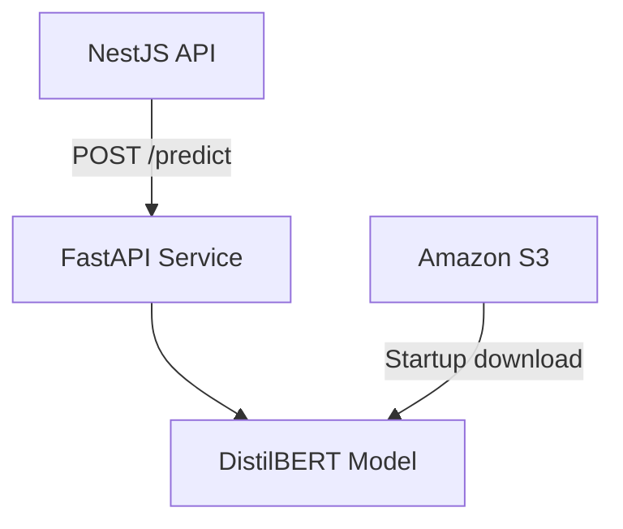

# Let Eat Go AI Service

[English](README.md) | **日本語**

> Let Eat Goのコミュニティ機能を支えるDistilBERTテキスト分類API

<p align="center">
  
  
  
  
</p>

## 概要

不適切表現を分類するFastAPI Interfaceです。起動時にFine-tuning済みDistilBERT ModelをLocal File SystemからLoadするか、Amazon S3からModel ArtifactをDownloadします。

[Let Eat Go Backend API](https://github.com/YJU-5/project-leteatgo-nestjs-repo)は、コミュニティ投稿を処理する前に、ユーザー生成テキストを本サービスへ送信します。

## 主な責務

- Fine-tuning済みDistilBERT Tokenizer／Sequence Classification ModelのLoad
- Amazon S3からModel ArtifactをDownloadし、安全に展開
- 型付き`POST /predict` Endpointによるテキスト分類
- `GET /health`によるModel Ready状態の公開
- 環境変数によるCORS、Model Path、Logging、Threshold設定

## アーキテクチャ



## API

### Predict

```http
POST /predict
Content-Type: application/json

{
  "text": "Text to classify"
}
```

Response：

```json
{
  "is_profanity": false,
  "confidence": 0.04
}
```

### Health

```http
GET /health
```

```json
{
  "status": "healthy",
  "model_loaded": true
}
```

## セットアップ

### 必要環境

- Python 3.9+
- Fine-tuning済みModelのLocal Directory、または設定したS3 ObjectへのAWS Access

### インストール

```bash
git clone https://github.com/YJU-5/ai-service.git
cd ai-service
python -m venv .venv
source .venv/bin/activate
pip install -r requirements.txt
cp .env.example .env
uvicorn main:app --reload --port 8000
```

FastAPI Documentation： [http://localhost:8000/docs](http://localhost:8000/docs)

## 環境変数

| 変数 | 必須 | 説明 |
| --- | --- | --- |
| `MODEL_DIR` | No | 展開済みModel Directory。既定値`./profanity_filter_model` |
| `MODEL_ARCHIVE` | No | 一時Archive Path |
| `S3_BUCKET_NAME` | Local Modelがない場合 | Modelを保存するS3 Bucket |
| `S3_MODEL_KEY` | No | Model ArchiveのObject Key |
| `AWS_DEFAULT_REGION` | S3利用時 | AWS Region |
| `AWS_ACCESS_KEY_ID` | Local S3のみ | 任意のLocal AWS Credential |
| `AWS_SECRET_ACCESS_KEY` | Local S3のみ | 任意のLocal AWS Credential |
| `CORS_ORIGINS` | No | 許可するOrigin（カンマ区切り） |
| `PROFANITY_THRESHOLD` | No | Classification Threshold。既定値`0.5` |
| `LOG_LEVEL` | No | Python Logging Level |

## Docker

```bash
docker build -t let-eat-go-ai .
docker run --rm -p 8000:8000 --env-file .env let-eat-go-ai
```

AWS環境では長期CredentialをImageへ保存せず、IAM Roleを使用してください。

## テスト

```bash
pip install -r requirements-dev.txt
pytest
```

基本Test SuiteはModelをDownloadせず、設定ParsingとHealth Responseを検証します。

## ライセンス

教育目的のチームプロジェクトとして作成しました。オープンソースライセンスは宣言していません。
