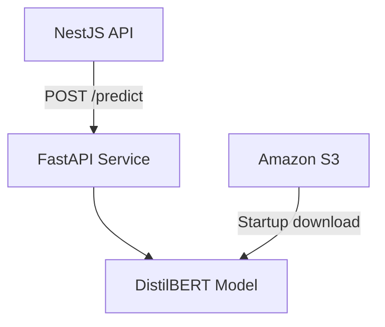

# Let Eat Go AI Service

**English** | [日本語](README.ja.md)

> Let Eat Goのコミュニティ機能を支えるDistilBERTテキスト分類API

<p align="center">
  
  
  
  
</p>

## About

This service exposes a small FastAPI interface for profanity classification. At startup it loads a fine-tuned DistilBERT model from the local filesystem or downloads the model artifact from Amazon S3.

The [Let Eat Go Backend API](https://github.com/YJU-5/project-leteatgo-nestjs-repo) sends user-generated text to this service before processing community content.

## Responsibilities

- Load a fine-tuned DistilBERT tokenizer and sequence-classification model
- Download and safely extract the model artifact from Amazon S3
- Classify text through a typed `POST /predict` endpoint
- Expose model readiness through `GET /health`
- Configure CORS, model paths, logging, and thresholds with environment variables

## Architecture



## API

### Predict

```http
POST /predict
Content-Type: application/json

{
  "text": "Text to classify"
}
```

Response:

```json
{
  "is_profanity": false,
  "confidence": 0.04
}
```

### Health

```http
GET /health
```

```json
{
  "status": "healthy",
  "model_loaded": true
}
```

## Getting Started

### Prerequisites

- Python 3.9+
- A local fine-tuned model directory, or AWS access to the configured S3 object

### Installation

```bash
git clone https://github.com/YJU-5/ai-service.git
cd ai-service
python -m venv .venv
source .venv/bin/activate
pip install -r requirements.txt
cp .env.example .env
uvicorn main:app --reload --port 8000
```

FastAPI documentation is available at [http://localhost:8000/docs](http://localhost:8000/docs).

## Environment Variables

| Variable | Required | Description |
| --- | --- | --- |
| `MODEL_DIR` | No | Extracted model directory; defaults to `./profanity_filter_model` |
| `MODEL_ARCHIVE` | No | Temporary archive path |
| `S3_BUCKET_NAME` | Without local model | S3 bucket containing the model |
| `S3_MODEL_KEY` | No | Model archive object key |
| `AWS_DEFAULT_REGION` | For S3 | AWS region |
| `AWS_ACCESS_KEY_ID` | Local S3 only | Optional local AWS credential |
| `AWS_SECRET_ACCESS_KEY` | Local S3 only | Optional local AWS credential |
| `CORS_ORIGINS` | No | Comma-separated allowed origins |
| `PROFANITY_THRESHOLD` | No | Classification threshold; defaults to `0.5` |
| `LOG_LEVEL` | No | Python logging level |

## Docker

```bash
docker build -t let-eat-go-ai .
docker run --rm -p 8000:8000 --env-file .env let-eat-go-ai
```

Use an IAM role in AWS environments instead of storing long-lived credentials in the image.

## Tests

```bash
pip install -r requirements-dev.txt
pytest
```

The basic test suite validates configuration parsing and the health response without downloading the model.

## License

This repository was created as an educational team project. No open-source license has been declared.
